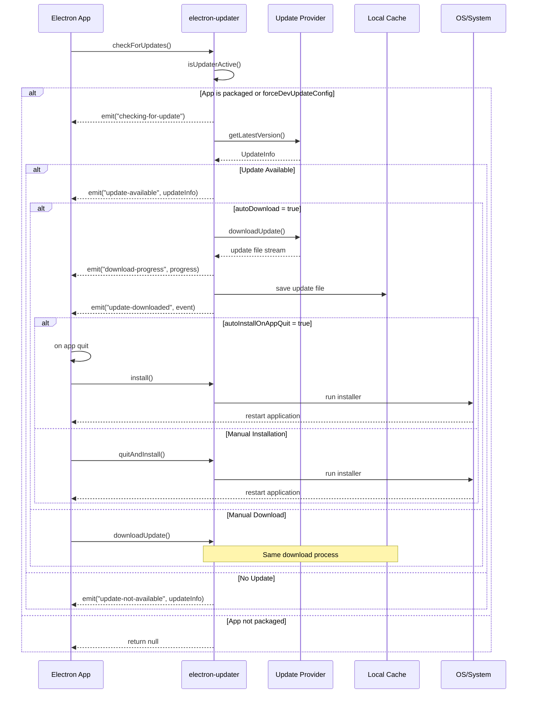

# electron-updaterの自動更新実行フロー詳細解説

## 概要

このドキュメントでは、electron-updaterがどこから何を取得し、どのタイミングでどのようにデスクトップアプリケーションを更新するのかについて詳細に解説します。

## 自動更新の全体フロー



## 1. 更新チェックのトリガーとタイミング

### 1.1 更新チェックの開始条件

electron-updaterが動作するためには以下の条件が必要です：

#### パッケージ化チェック
```typescript
// packages/electron-updater/src/AppUpdater.ts:350-361
public isUpdaterActive(): boolean {
  const isEnabled = this.app.isPackaged || this.forceDevUpdateConfig
  if (!isEnabled) {
    this._logger.info("Skip checkForUpdates because application is not packed and dev update config is not forced")
    return false
  }
  return true
}
```

**重要**: 開発環境では`forceDevUpdateConfig = true`を設定しない限り、更新チェックは実行されません。

#### 更新チェックの手動トリガー

更新チェックは以下のメソッドで開始されます：

```typescript
// packages/electron-updater/src/AppUpdater.ts:503-536
private async doCheckForUpdates(): Promise<UpdateCheckResult> {
  this.emit("checking-for-update")

  const result = await this.getUpdateInfoAndProvider()
  const updateInfo = result.info
  
  if (!(await this.isUpdateAvailable(updateInfo))) {
    this.emit("update-not-available", updateInfo)
    return {
      isUpdateAvailable: false,
      versionInfo: updateInfo,
      updateInfo,
    }
  }

  this.updateInfoAndProvider = result
  this.onUpdateAvailable(updateInfo)

  return {
    isUpdateAvailable: true,
    versionInfo: updateInfo,
    updateInfo,
    cancellationToken: new CancellationToken(),
    downloadPromise: this.autoDownload ? this.downloadUpdate(cancellationToken) : null,
  }
}
```

## 2. 更新情報の取得

### 2.1 プロバイダーからの情報取得

electron-updaterは設定されたプロバイダーから最新の更新情報を取得します：

#### GitHub Provider (Public)
```typescript
// packages/electron-updater/src/providers/GitHubProvider.ts:60-66
const feedXml: string = (await this.httpRequest(
  newUrlFromBase(`${this.basePath}.atom`, this.baseUrl),
  {
    accept: "application/xml, application/atom+xml, text/xml, */*",
  },
  cancellationToken
))!
```

**取得先**: `https://github.com/{owner}/{repo}/releases.atom`

#### GitHub Provider (Private)
```typescript
// packages/electron-updater/src/providers/PrivateGitHubProvider.ts:58-62
private configureHeaders(accept: string) {
  return {
    accept,
    authorization: `token ${this.token}`,
  }
}
```

**取得先**: `https://api.github.com/repos/{owner}/{repo}/releases`

#### Generic Provider
カスタムサーバーから`latest.yml`（macOSの場合は`latest-mac.yml`）を取得

### 2.2 バージョン比較ロジック

```typescript
// packages/electron-updater/src/AppUpdater.ts:429-463
private async isUpdateAvailable(updateInfo: UpdateInfo): Promise<boolean> {
  const latestVersion = parseVersion(updateInfo.version)
  const currentVersion = this.currentVersion
  
  // 1. バージョンが同じ場合
  if (isVersionsEqual(latestVersion, currentVersion)) {
    return false
  }

  // 2. 更新サポートチェック
  if (!(await Promise.resolve(this.isUpdateSupported(updateInfo)))) {
    return false
  }

  // 3. ロールアウトチェック
  const isUserWithinRollout = await Promise.resolve(this.isUserWithinRollout(updateInfo))
  if (!isUserWithinRollout) {
    return false
  }

  // 4. バージョン比較
  const isLatestVersionNewer = isVersionGreaterThan(latestVersion, currentVersion)
  const isLatestVersionOlder = isVersionLessThan(latestVersion, currentVersion)

  if (isLatestVersionNewer) {
    return true
  }
  return this.allowDowngrade && isLatestVersionOlder
}
```

## 3. 更新ファイルのダウンロード

### 3.1 ダウンロード場所の決定

更新ファイルは以下の場所にダウンロードされます：

#### キャッシュディレクトリの構造
```typescript
// packages/electron-updater/src/AppAdapter.ts:30-47
export function getAppCacheDir() {
  const homedir = getHomedir()
  let result: string
  if (process.platform === "win32") {
    result = process.env["LOCALAPPDATA"] || path.join(homedir, "AppData", "Local")
  } else if (process.platform === "darwin") {
    result = path.join(homedir, "Library", "Caches")
  } else {
    result = process.env["XDG_CACHE_HOME"] || path.join(homedir, ".cache")
  }
  return result
}
```

#### 実際のダウンロードパス
```typescript
// packages/electron-updater/src/AppUpdater.ts:683-708
private async getOrCreateDownloadHelper(): Promise<DownloadedUpdateHelper> {
  const dirName = (await this.configOnDisk.value).updaterCacheDirName
  const cacheDir = path.join(this.app.baseCachePath, dirName || this.app.name)
  // 実際のファイルは cacheDir/pending/ に保存される
}
```

**ダウンロードパスの例**:
- **Windows**: `C:\Users\{username}\AppData\Local\{app-name}\pending\`
- **macOS**: `/Users/{username}/Library/Caches/{app-name}/pending/`
- **Linux**: `/home/{username}/.cache/{app-name}/pending/`

### 3.2 ダウンロード処理

```typescript
// packages/electron-updater/src/AppUpdater.ts:708-797
protected async executeDownload(taskOptions: DownloadExecutorTask): Promise<Array<string>> {
  const downloadedUpdateHelper = await this.getOrCreateDownloadHelper()
  const cacheDir = downloadedUpdateHelper.cacheDirForPendingUpdate
  await mkdir(cacheDir, { recursive: true })

  // 1. キャッシュされたファイルの確認
  const cachedUpdateFile = await downloadedUpdateHelper.validateDownloadedPath(updateFile, updateInfo, fileInfo, log)
  if (cachedUpdateFile != null) {
    updateFile = cachedUpdateFile
    return await done(false)
  }

  // 2. 一時ファイルの作成とダウンロード
  const tempUpdateFile = await createTempUpdateFile(`temp-${updateFileName}`, cacheDir, log)
  try {
    await taskOptions.task(tempUpdateFile, downloadOptions, packageFile, removeFileIfAny)
    await retry(() => rename(tempUpdateFile, updateFile), 60, 500, 0, 0)
  } catch (e: any) {
    await removeFileIfAny()
    throw e
  }

  log.info(`New version ${version} has been downloaded to ${updateFile}`)
  return await done(true)
}
```

### 3.3 ダウンロード進捗とイベント

```typescript
// ダウンロード進捗の監視
autoUpdater.on('download-progress', (progressObj) => {
  let log_message = "Download speed: " + progressObj.bytesPerSecond;
  log_message = log_message + ' - Downloaded ' + progressObj.percent + '%';
  log_message = log_message + ' (' + progressObj.transferred + "/" + progressObj.total + ')';
  console.log(log_message);
});

// ダウンロード完了
autoUpdater.on('update-downloaded', (info) => {
  console.log('Update downloaded');
  // 自動インストールまたは手動インストール
});
```

### 3.4 差分ダウンロード（Differential Download）

electron-updaterは効率的な更新のために差分ダウンロードをサポート：

```typescript
// packages/electron-updater/src/AppUpdater.ts:109
disableDifferentialDownload = false
```

**メリット**:
- ダウンロードサイズの削減
- 更新時間の短縮
- 帯域使用量の削減

**対応プラットフォーム**:
- Windows (NSIS)
- macOS (ZIP archives)
- Linux (AppImage)

## 4. プラットフォーム別の更新処理

### 4.1 Windows (NSIS Updater)

#### ダウンロード処理
```typescript
// packages/electron-updater/src/NsisUpdater.ts:41-104
protected doDownloadUpdate(downloadUpdateOptions: DownloadUpdateOptions): Promise<Array<string>> {
  const provider = downloadUpdateOptions.updateInfoAndProvider.provider
  const fileInfo = findFile(provider.resolveFiles(downloadUpdateOptions.updateInfoAndProvider.info), "exe")!
  
  return this.executeDownload({
    fileExtension: "exe",
    downloadUpdateOptions,
    fileInfo,
    task: async (destinationFile, downloadOptions, packageFile, removeTempDirIfAny) => {
      // 1. Web Installerのチェック
      // 2. 差分ダウンロードの実行
      // 3. 署名検証
      // 4. パッケージファイルのダウンロード（Web Installerの場合）
    },
  })
}
```

#### インストール処理
```typescript
// packages/electron-updater/src/NsisUpdater.ts:124-179
protected doInstall(options: InstallOptions): boolean {
  const installerPath = this.installerPath
  const args = ["--updated"]
  
  if (options.isSilent) {
    args.push("/S")
  }
  
  if (options.isForceRunAfter) {
    args.push("--force-run")
  }
  
  // 管理者権限が必要な場合
  if (options.isAdminRightsRequired) {
    this.spawnLog(path.join(process.resourcesPath, "elevate.exe"), [installerPath].concat(args))
  } else {
    this.spawnLog(installerPath, args)
  }
  
  return true
}
```

### 4.2 macOS (Mac Updater)

macOSでは特殊なプロキシサーバー方式を使用：

```typescript
// packages/electron-updater/src/MacUpdater.ts:133-255
private async updateDownloaded(zipFileInfo: ResolvedUpdateFileInfo, event: UpdateDownloadedEvent): Promise<Array<string>> {
  // 1. ローカルプロキシサーバーの作成
  this.server = createServer()
  
  return await new Promise<Array<string>>((resolve, reject) => {
    // 2. 認証情報の生成
    const pass = randomBytes(64).toString("base64")
    const authInfo = Buffer.from(`autoupdater:${pass}`, "ascii")
    
    // 3. ファイルサーバーの設定
    this.server!.on("request", (request, response) => {
      // 認証チェック
      // ファイルストリームの配信
    })
    
    // 4. Squirrel.Macへのフィード設定
    this.nativeUpdater.setFeedURL({
      url: getServerUrl(this.server!),
      headers: {
        "Cache-Control": "no-cache",
        Authorization: `Basic ${authInfo.toString("base64")}`,
      },
    })
    
    // 5. 更新の実行
    if (this.autoInstallOnAppQuit) {
      this.nativeUpdater.checkForUpdates()
    }
  })
}
```

### 4.3 Linux (AppImage Updater)

#### インストール処理
```typescript
// packages/electron-updater/src/AppImageUpdater.ts:76-122
protected doInstall(options: InstallOptions): boolean {
  const appImageFile = process.env["APPIMAGE"]!
  
  // 1. 古いファイルの削除
  unlinkSync(appImageFile)
  
  // 2. 新しいファイルの配置
  const destination = determineDestination(appImageFile, installerPath)
  execFileSync("mv", ["-f", installerPath, destination])
  
  // 3. アプリケーションの再起動
  if (options.isForceRunAfter) {
    this.spawnLog(destination, [], env)
  } else {
    env.APPIMAGE_EXIT_AFTER_INSTALL = "true"
    execFileSync(destination, [], { env })
  }
  
  return true
}
```

### 4.4 Linux (deb/rpm/pacman Updater)

#### パッケージタイプの検出
```typescript
// packages/electron-updater/src/main.ts:22-61
function doLoadAutoUpdater(): AppUpdater {
  if (process.platform === "linux") {
    _autoUpdater = new (require("./AppImageUpdater").AppImageUpdater)()
    
    try {
      const identity = path.join(process.resourcesPath, "package-type")
      if (existsSync(identity)) {
        const fileType = readFileSync(identity).toString().trim()
        switch (fileType) {
          case "deb":
            _autoUpdater = new (require("./DebUpdater").DebUpdater)()
            break
          case "rpm":
            _autoUpdater = new (require("./RpmUpdater").RpmUpdater)()
            break
          case "pacman":
            _autoUpdater = new (require("./PacmanUpdater").PacmanUpdater)()
            break
        }
      }
    } catch (error: any) {
      console.warn("Unable to detect 'package-type' for autoUpdater")
    }
  }
  return _autoUpdater
}
```

#### deb パッケージのインストール
```typescript
// packages/electron-updater/src/DebUpdater.ts:29-53
protected doInstall(options: InstallOptions): boolean {
  const priorityList = ["dpkg", "apt"]
  const packageManager = this.detectPackageManager(priorityList)
  
  try {
    DebUpdater.installWithCommandRunner(packageManager, installerPath, this.runCommandWithSudoIfNeeded.bind(this), this._logger)
  } catch (error: any) {
    this.dispatchError(error)
    return false
  }
  
  if (options.isForceRunAfter) {
    this.app.relaunch()
  }
  return true
}
```

## 5. インストールタイミングの制御

### 5.1 自動インストール（アプリ終了時）

```typescript
// packages/electron-updater/src/AppUpdater.ts:60-63
/**
 * Whether to automatically install a downloaded update on app quit (if `quitAndInstall` was not called before).
 * @default true
 */
autoInstallOnAppQuit = true
```

```typescript
// packages/electron-updater/src/BaseUpdater.ts:76-104
protected addQuitHandler(): void {
  this.app.onQuit(exitCode => {
    if (this.quitAndInstallCalled) {
      this._logger.info("Update installer has already been triggered. Quitting application.")
      return
    }

    if (!this.autoInstallOnAppQuit) {
      this._logger.info("Update will not be installed on quit because autoInstallOnAppQuit is set to false.")
      return
    }

    if (exitCode !== 0) {
      this._logger.info(`Update will be not installed on quit because application is quitting with exit code ${exitCode}`)
      return
    }

    this._logger.info("Auto install update on quit")
    this.install(true, false)
  })
}
```

### 5.2 手動インストール

```typescript
// 手動でのインストール実行
autoUpdater.quitAndInstall(
  isSilent,        // Windows: サイレントインストール
  isForceRunAfter  // インストール後の強制再起動
);
```

### 5.3 インストールオプション

```typescript
export interface InstallOptions {
  readonly isSilent: boolean           // サイレントインストール
  readonly isForceRunAfter: boolean    // インストール後の強制実行
  readonly isAdminRightsRequired: boolean  // 管理者権限の要求
}
```

## 6. エラーハンドリングとイベント

### 6.1 主要イベント

```typescript
export type AppUpdaterEvents = {
  error: (error: Error, message?: string) => void
  login: (info: AuthInfo, callback: LoginCallback) => void
  "checking-for-update": () => void
  "update-not-available": (info: UpdateInfo) => void
  "update-available": (info: UpdateInfo) => void
  "update-downloaded": (event: UpdateDownloadedEvent) => void
  "download-progress": (info: ProgressInfo) => void
  "update-cancelled": (info: UpdateInfo) => void
  "appimage-filename-updated": (path: string) => void
}
```

### 6.2 イベント使用例

```typescript
import { autoUpdater } from 'electron-updater';

// 更新チェック開始
autoUpdater.on('checking-for-update', () => {
  console.log('Checking for update...');
});

// 更新が利用可能
autoUpdater.on('update-available', (info) => {
  console.log('Update available.');
});

// 更新が利用不可
autoUpdater.on('update-not-available', (info) => {
  console.log('Update not available.');
});

// エラー発生
autoUpdater.on('error', (err) => {
  console.log('Error in auto-updater. ' + err);
});

// ダウンロード進捗
autoUpdater.on('download-progress', (progressObj) => {
  let log_message = "Download speed: " + progressObj.bytesPerSecond;
  log_message = log_message + ' - Downloaded ' + progressObj.percent + '%';
  log_message = log_message + ' (' + progressObj.transferred + "/" + progressObj.total + ')';
  console.log(log_message);
});

// ダウンロード完了
autoUpdater.on('update-downloaded', (info) => {
  console.log('Update downloaded');
  autoUpdater.quitAndInstall();
});
```

## 7. キャッシュとデータ管理

### 7.1 更新情報のキャッシュ

```typescript
// packages/electron-updater/src/DownloadedUpdateHelper.ts:57-80
async setDownloadedFile(
  downloadedFile: string,
  packageFile: string | null,
  versionInfo: UpdateInfo,
  fileInfo: ResolvedUpdateFileInfo,
  updateFileName: string,
  isSaveCache: boolean
): Promise<void> {
  this._file = downloadedFile
  this._packageFile = packageFile
  this.versionInfo = versionInfo
  this.fileInfo = fileInfo
  this._downloadedFileInfo = {
    fileName: updateFileName,
    sha512: fileInfo.info.sha512,
    isAdminRightsRequired: fileInfo.info.isAdminRightsRequired === true,
  }

  if (isSaveCache) {
    await outputJson(this.getUpdateInfoFile(), this._downloadedFileInfo)
  }
}
```

### 7.2 整合性チェック

```typescript
// packages/electron-updater/src/DownloadedUpdateHelper.ts:97-154
private async getValidCachedUpdateFile(fileInfo: ResolvedUpdateFileInfo, logger: Logger): Promise<string | null> {
  // 1. update-info.jsonファイルの存在確認
  // 2. ファイル情報の読み込み
  // 3. SHA512チェックサムの検証
  // 4. 実際のファイルの存在確認
  // 5. ファイル内容のハッシュ検証
  
  if (fileInfo.info.sha512 !== sha512) {
    logger.warn(`Sha512 checksum doesn't match the latest available update. New update must be downloaded.`)
    await this.cleanCacheDirForPendingUpdate()
    return null
  }
  
  return updateFile
}
```

## 8. 設定とカスタマイズ

### 8.1 主要設定オプション

```typescript
// packages/electron-updater/src/AppUpdater.ts:51-109
export abstract class AppUpdater extends EventEmitter {
  /**
   * Whether to automatically download an update when it is found.
   * @default true
   */
  autoDownload = true

  /**
   * Whether to automatically install a downloaded update on app quit.
   * @default true
   */
  autoInstallOnAppQuit = true

  /**
   * Whether to run the app after finish install when run the installer is NOT in silent mode.
   * @default true
   */
  autoRunAppAfterInstall = true

  /**
   * Whether to allow update to pre-release versions.
   */
  allowPrerelease = false

  /**
   * Whether to allow version downgrade.
   * @default false
   */
  allowDowngrade = false

  /**
   * Web installer files might not have signature verification.
   * @default false
   */
  disableWebInstaller = false

  /**
   * *NSIS only* Disable differential downloads.
   * @default false
   */
  disableDifferentialDownload = false
}
```

### 8.2 カスタムプロバイダーの設定

```typescript
// Generic providerの使用例
autoUpdater.setFeedURL({
  provider: 'generic',
  url: 'https://example.com/auto-updater',
  channel: 'latest'
});

// GitHub providerの使用例
autoUpdater.setFeedURL({
  provider: 'github',
  owner: 'electron-userland',
  repo: 'electron-builder',
  private: false
});
```

## 9. セキュリティ考慮事項

### 9.1 署名検証

Windows版では、ダウンロードしたインストーラーの署名検証が実行されます：

```typescript
// packages/electron-updater/src/NsisUpdater.ts:73-81
const signatureVerificationStatus = await this.verifySignature(destinationFile)
if (signatureVerificationStatus != null) {
  await removeTempDirIfAny()
  throw newError(
    `New version ${downloadUpdateOptions.updateInfoAndProvider.info.version} is not signed by the application owner: ${signatureVerificationStatus}`,
    "ERR_UPDATER_INVALID_SIGNATURE"
  )
}
```

### 9.2 整合性チェック

すべてのプラットフォームでSHA512チェックサムによる整合性確認が実行されます：

```typescript
// packages/electron-updater/src/AppUpdater.ts:712-717
const downloadOptions: DownloadOptions = {
  headers: taskOptions.downloadUpdateOptions.requestHeaders,
  cancellationToken: taskOptions.downloadUpdateOptions.cancellationToken,
  sha2: (fileInfo.info as any).sha2,
  sha512: fileInfo.info.sha512,
}
```

## 10. トラブルシューティング

### 10.1 よくある問題

#### 開発環境で更新チェックが動作しない
```typescript
// 解決方法: forceDevUpdateConfigを設定
autoUpdater.forceDevUpdateConfig = true;
```

#### 更新ファイルのダウンロード失敗
- ネットワーク接続の確認
- プロキシ設定の確認
- 証明書の問題（HTTPS）

#### インストール権限エラー（Windows）
```typescript
// 管理者権限でのインストール実行
autoUpdater.quitAndInstall(true, false);
```

### 10.2 ログとデバッグ

```typescript
import log from 'electron-log';

// ログレベルの設定
log.transports.file.level = 'debug';
autoUpdater.logger = log;

// ログファイルの場所
// Windows: %USERPROFILE%\AppData\Roaming\{app name}\logs\main.log
// macOS: ~/Library/Logs/{app name}/main.log
// Linux: ~/.config/{app name}/logs/main.log
```

## まとめ

electron-updaterは以下の流れで自動更新を実行します：

1. **更新チェック**: アプリ起動時またはユーザーアクションで実行
2. **バージョン比較**: セマンティックバージョニングによる比較
3. **ファイルダウンロード**: プラットフォーム固有のキャッシュディレクトリに保存
4. **整合性検証**: SHA512チェックサムによる検証
5. **インストール実行**: プラットフォーム別の方法でインストール
6. **アプリ再起動**: 新しいバージョンでの起動

この流れを理解することで、適切な更新戦略の設計と問題の解決が可能になります。特に、イベントハンドリングとエラー処理の適切な実装が、ユーザー体験の向上に重要です。

## 参考資料

- [electron-updater API](https://www.electron.build/auto-update)
- [Electron Security Guidelines](https://www.electronjs.org/docs/latest/tutorial/security)
- [Code Signing Best Practices](https://www.electron.build/code-signing) 